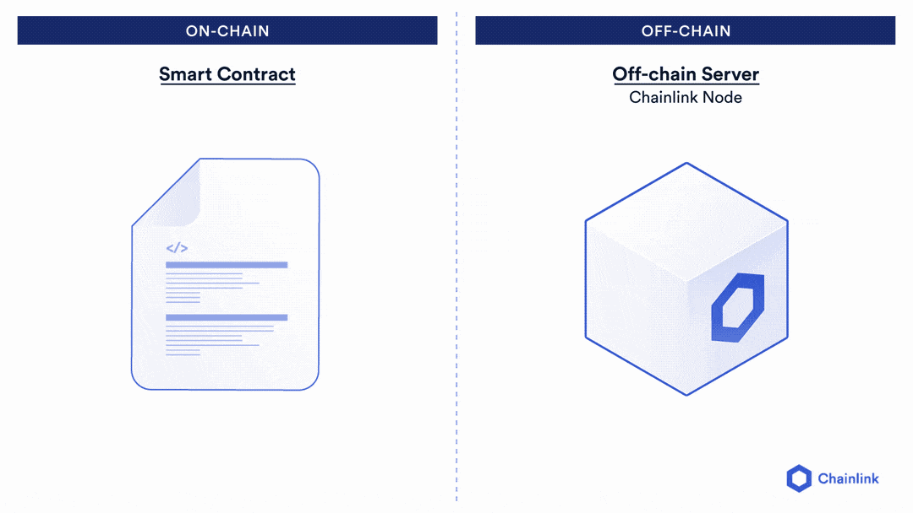

# Chainlink API Calls

<br/>
<p align="center">

</p>
<br/>

**Note! This section is optional!**

# Introduction

As this is the most advanced feature of working with Chainlink oracles, but also the least used, we are going to move quickly through this section. 

If you want a more end-to-end breakdown, be sure to check out the [Advanced Tutorial](https://docs.chain.link/docs/advanced-tutorial/) for making API calls. 

The reason this is used the least is that it requires the most work to put into a decentralized context. Chainlink Keepers is decentralized. Data feeds are already decentralized. Chainlink VRF is cryptographically ensured.

But Chainlink API Calls, you have to do the work to make it decentralized, since this will show you how to connect with 1 node and pull from 1 data source.

However, if you master this skill, this is what enables you to have your smart contracts have unlimited customization.

You want some obscure data? Like number of dogs in Canada? You could use this feature to get the data.

Maybe you want the temperature in France? Boom. Use this feature.

You want to have your artificial intelligence bot buy a car from your bank account? Yes, even that can be done with this. 

Chainlink API calls are the customization layer of whatever smart contract application you use. You'll just want to keep in mind the decentrality trade-offs. You can 100% use centralized APIs and nodes, but just need to remember this means your application has a centralization vector. 

We have seen projects use these features and go on to be very successful though, so let's learn!

# Making API Calls

We can make any httpget, httppost API call with Chainlink. Chainlink API calls follow the basic request model similar to Chainlink VRF. To make an API call, we need the following information.

1. The Chainlink node's oracle contract we want to interact with (yes, we have to choose which node we work with!)
2. The `jobId` of the Chainlink node. 
3. LINK token (for oracle gas)
4. The API that we want to call
5. The data that we want to return from the API call.

For example, let's take an HTTP GET API call that returns something like the following:

```
{"price": 
    {
    "ETH": 123.123
    }
}
```

Let's say we want that `123.123` value. To get it, we would need:

1. A Chainlink Node that can make HTTP GET API calls
2. That Chainlink node's job that can return a `uint256`
3. That Chainlink node's job that will multiply `123.123` by `1000` to remove the decimals.

So there are a few things to think about when choosing a Chainlink oracle. You can find Chainlink oracles from node listing services like [market.link](https://market.link/). 


## Our example

In our example, we are going to make an API call to `https://min-api.cryptocompare.com/data/pricemultifull?fsyms=ETH&tsyms=USD`. You should be able to click this URL and see a response right in your browser that looks something like: 


```
{
    "RAW": {
        "ETH": {
            "USD": {
                "TYPE": "5",
                "MARKET": "CCCAGG",
                "FROMSYMBOL": "ETH",
                "TOSYMBOL": "USD",
                "FLAGS": "2052",
                "PRICE": 3393.17,
                "LASTUPDATE": 1631110406,
                "MEDIAN": 3393.41,
                "LASTVOLUME": 0.00128789,
                "LASTVOLUMETO": 4.3699910746,
                "LASTTRADEID": "153523194",
                "VOLUMEDAY": 448197.17201560905,
                "VOLUMEDAYTO": 1518335867.9418519,
                "VOLUME24HOUR": 1070309.6061865,
                "VOLUME24HOURTO": 3637695227.5570655,
                "OPENDAY": 3434.81,
                "HIGHDAY": 3543.26,
                "LOWDAY": 3217.86,
                "OPEN24HOUR": 3407.72,
.
.
.
            }
        }
    }
}
```

And we are going to get the `VOLUME24HOUR` variable into our contracts. 
You can see we inherit `ChainlinkClient` from the Chainlink contracts package which holds the functionality for making requests. We've already got you started by choosing a few variables for you. 

1. The Chainlink Oracle
```
oracle = 0xc57B33452b4F7BB189bB5AfaE9cc4aBa1f7a4FD8;
```
This represents the Chainlink oracle contract that we are going to interact with. It represents the [Chainlink DevRel Kovan Oracle](https://market.link/nodes/7607c57d-62b8-4c1b-9894-ff9e25d47107/metrics?start=1630505761&end=1631110561)

2. The JobID
```
jobId = "d5270d1c311941d0b08bead21fea7747";
```

This is a job that has the following `tasks` or `adapters`:

1. `httpGet`: The ability to make an HTTP GET API call.
2. `jsonparse`: The ability to parse JSON. This means it can "read" the JSON response of the HTTP GET API response above, and traverse down to `VOLUME24HOUR`.
3. `multiply`: The ability to multiply a result to remove any decimals. 
4. `ethuint256`: The ability to cast the integer response into a `uint256`.
5. `ethtx`: The ability to make a transaction back on-chain.

You can see a full list of tasks / adapters in the [Chainlink documentation](https://docs.chain.link/docs/tasks/). 

You can see the list of tasks of this [job in the marketplace.](https://market.link/jobs/f5357a30-54b7-4a68-b6a8-ae55d4eda987)

3. The Fee

```
fee = 0.1 * 10 ** 18;
```

Each node can set a fee associated with a job. Typically you can see the fee on the [job listing in the marketplace.](https://market.link/jobs/f5357a30-54b7-4a68-b6a8-ae55d4eda987)


# The basic Request Model

Since Chainlink API calls also follow the basic request model, we once again have a requesting function:

```
function requestVolumeData() public returns (bytes32 requestId) 
    {
        // Start here!
    }
```

And a callback / returning function:

```
function fulfill(bytes32 _requestId, uint256 _volume) public recordChainlinkFulfillment(_requestId)
    {
        volume = _volume;
    }
```

Our requesting function is what we are going to fill in, and our fulfillment function is already all done!

Similar to the Chainlink VRF, it takes a `bytes32 _requestId` which identifies the request Id that we make above, and a `uint256 _volume` which will be the return data from the API call. 

Once again, since we are requesting data, we are going to have to fund out contract with LINK for it to pay the oracle gas. 

## Creating our `requestVolumeData` function

We are going to create our `requestVolumeData` function by adding in some lines of code to help identify which of the `tasks` we are going to take advantage of. For Chainlink API calls, the first thing we need to do is make the `request` object.

```
Chainlink.Request memory request = buildChainlinkRequest(<jobId>, <callbackAddress>, <callbackFunctionSelector>);
```

With Chainlink API calls, we choose an address that we want to return data too, along with which function we want to return to. In our example, we are going to use `address(this)` as our callback address, and `this.fulfill.selector` as our callbackFunctionSelector. 

Then, we can tell our node what API to make an HTTP GET call to with:

```
request.add("get", <URL>);
```

Then, we choose which value in the json response by picking a `path` for the `jsonparse` to use, for example:
```
request.add("path", "RAW.ETH.USD.VOLUME24HOUR");
```
        
Then we can multiply:
```
int timesAmount = 10**18;
request.addInt("times", timesAmount);
```
        
And finally, we send the request:
```
return sendChainlinkRequestTo(oracle, request, fee);
```

Ok! There is a LOT of information here! Let's see you fill in that requesting function!