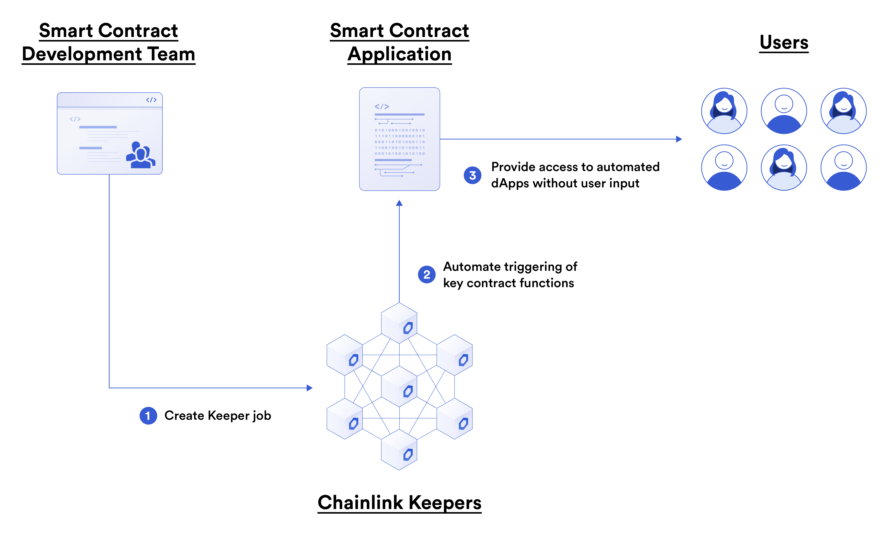

Now that we know what oracles are, what they do, and why we need them, we can go into using oracles to empower our smart contracts!

# What is Chainlink? 

Chainlink is a decentralized oracle network for retrieving off-chain data, and executing off-chain computation. Decentralized oracle networks (DONs) can be customized to do relatively anything to empower smart contracts to have unlimited customization. Chainlink comes packed with a few features that are just plug-and-play, ready to go, and require no work from a developer's end! 

### 1. Chainlink Data Feeds

 

 

[Chainlink Data Feeds](https://docs.chain.link/docs/using-chainlink-reference-contracts/) are one of the most popular use cases of Chainlink oracles. They are a way to get data from the real world in a decentralized context. A group of oracle off-chain all access data from some of the highest quality sources (many different high quality sources) and aggregate them to a single answer. They then publish this data on-chain to a smart contract for anyone to pull from. This makes gathering important data like pricing information of assets cheaper, more secure, decentralized, and more diligent than any centralized solution. The data feeds are one of the most battled tested solutions, being used by top protocols like Aave, Compound, and Synthetix for their DeFi protocols. 

### 2. Chainlink Verifiable Randomness Function (Chainlink VRF)

 

 

[Chainlink VRF](https://docs.chain.link/docs/chainlink-vrf/) is a way to get provably random numbers. Blockchains themselves are deterministic, and therefore, cannot get true randomness. We have to look outside the blockchain to get random numbers, but we don't want to get a number than can be snooped. Chainlink VRF is a proven way to get a random number that is cryptographically random. 

### 3. Chainlink Keepers

 

 

[Chainlink Keepers](https://docs.chain.link/docs/chainlink-keepers/introduction/) is a network of oracles delivering event driven decentralized computation. Right now, in order for the blockchain to change state, someone has to trigger a transaction. Chainlink Keepers allow us to do this in a decentralized context, allowing for us to have contracts interact with each other programmatically. 

### 4. Chainlink API Calls

And then finally, the [Chainlink API Calls](https://docs.chain.link/docs/request-and-receive-data/) are the piece of Chainlink infrastructure that allows unlimited customization. This features takes the most work to set up, but can be customized to make your smart contracts do roughly anything. They follow a [basic request model](https://docs.chain.link/docs/architecture-request-model/) where a user requests a piece of data from an oracle, in exchange for some oracle gas (LINK token). 

Chainlink allows us to make our smart contracts do literally anything. So let's get started!

