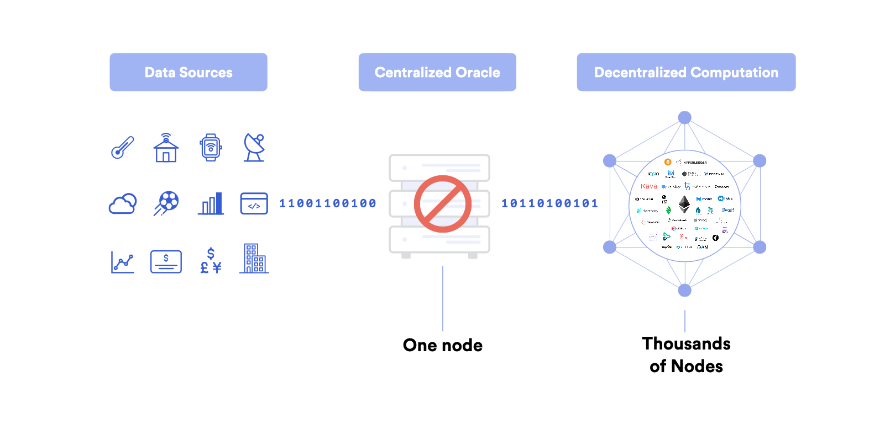
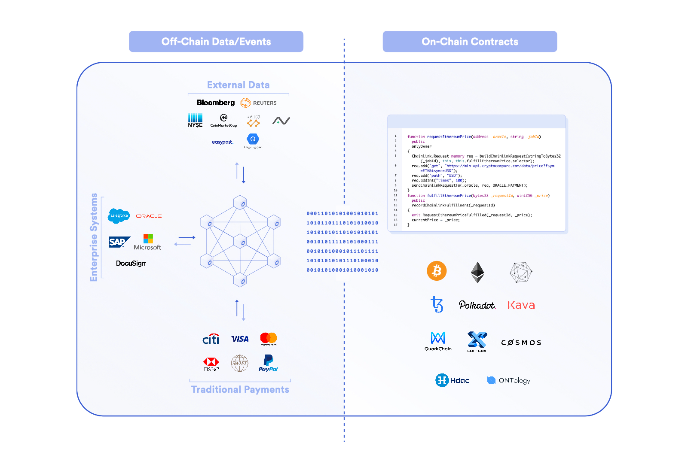

# Prerequisites

In order to that this class, a basic understanding of smart contracts and blockchain are required. Please take the [Introduction to Solidity](https://www.chainshot.com/learn/solidity) course, or have a decent understanding of smart contracts before proceeding here. 

 

 

# What is a blockchain oracle? 

Oracles, or [blockchain oracles](https://betterprogramming.pub/what-is-a-blockchain-oracle-f5ccab8dbd72) are critical infrastructure to the smart contract ecosystem. They allow for blockchains. and therefore smart contracts, to: 

1. Gather data from outside the blockchain.
2. Perform computation outside of the blockchain. 

They are any device or entity that connects a deterministic blockchain with an off-chain resource. 

### Data Examples

For example, let's say you want to build a betting smart contract, you want to place bets on whether or not the a team wins a sports match. In order for our smart contract to function correctly, it would need the data of the winning team. Or if you wanted to price some underlying collateral for a borrowing and lending application like [Aave](https://aave.com/), you'd need price data to calculate the value of that underlying collateral. 

### Computation Examples

Another use case might be to trigger some transaction after an event occurs, like if the price of an asset reaches a certain price -> buy or sell. Or, maybe you have some application that will get the median price of hundreds of assets, and you know that doing that on-chain will be very expensive, so you have a group do this all off-chain. 

## Why can't the blockchain just get the data or do the computation? 

Blockchains themselves can't make API calls, HTTP Get requests, because they are **deterministic** by design, this means they can't introduce or work with any non-deterministic data, or it would break their [consensus protocol](https://www.investopedia.com/terms/c/consensus-mechanism-cryptocurrency.asp).

## Why don't we just deliver the data? Does 1 oracle work? 

Now, often times people will say "well why don't I just get the data for my smart contract?", which could be equivalent to "why don't I just host the logic of the smart contract on my centralized server?". 

Having a single oracle, or a single data source is a point of centrality, and completely defeats the purpose of building on a blockchain in the first place. In order for our blockchain to have the same security, decentrality, and immutability is to have our data and computation come from a [decentralized oracle network (DON).](https://chain.link/whitepaper) 

 

 

## Hybrid Smart Contracts

Smart contracts that use oracles are often known as [Hybrid Smart Contracts](https://blog.chain.link/hybrid-smart-contracts-explained/) since they have both an on-chain and off-chain component. Many of the top protocols in the space are some form of a hybrid smart contract, since they all rely on getting some type of information from the outside world. Having a bridge to the real world is a critical piece the enables smart contracts to make impacts on our every day lives, and allows us to code more that token functionality. 

 

 

We need to have both our logic (written in solidity) and our data/external computation (retrieved by Chainlink/Oracles) in a decentralized context.

Hit next to move onto the what tools we can use to get this data!

