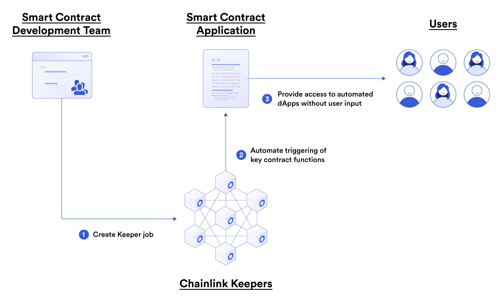

# Chainlink Keepers

 

 

Now, we are going to learn how to make event driven transactions in a decentralized context.

So... What does that even mean? We'll let's think about this...

Let's say, you have bought an asset or token, and you want to sell it when the price hits a certain level. Someone at some point is going to have to make a transaction to sell your asset/token. The blockchain can't initiate state changes without someone paying the gas. This means, we are going to have to give someone the power to make transactions on our behalf. But who do we give this power to? 

You could do a few things to make sure this happens.

1. Build an infrastructure of centralized servers to react and create a transaction on your behalf when the price hits that point.

2. Rely on someone else's infrastructure (maybe paid) to do so.

3. Use the collaborative decentralized Chainlink Keepers.

Chainlink keepers allow us to trigger event driven transactions in a decentralized context. This is a great route to go, but you're now at the mercy of that organization. Even more-so, if you're a decentralized protocol looking to trigger event based transactions, you shouldn't rely on a centralized infrastructure since you don't have to!

# Setting up a Keeper Compatible Contract

In order to setup our Keeper compatible contract, we need to do the follow.

1. Import the Keeper Compatible Interface
2. Register our contract with the [Keeper Registry](https://keepers.chain.link/)

The Keeper registry is an on-chain contract that connects all the Chainlink Keepers to all the jobs they are working on. In order to register our jobs to be triggered by Chainlink nodes, we have to fund something called a "job" from the Keeper compatible contract and fund it with LINK. Unlike the Chainlink VRF which follows a request model, Chainlink Keepers follows a subscription model. As long as your "job" on the keeper contract contains LINK, its funded and will execute jobs!

We won't go through funding our jobs with LINK, but if you want to follow along the [Chainlink documentation](https://docs.chain.link/docs/chainlink-keepers/introduction/), it will show you how to do everything. 
